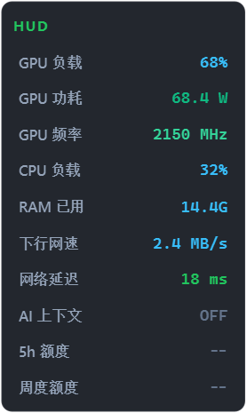
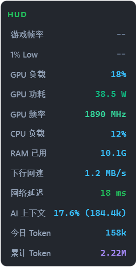
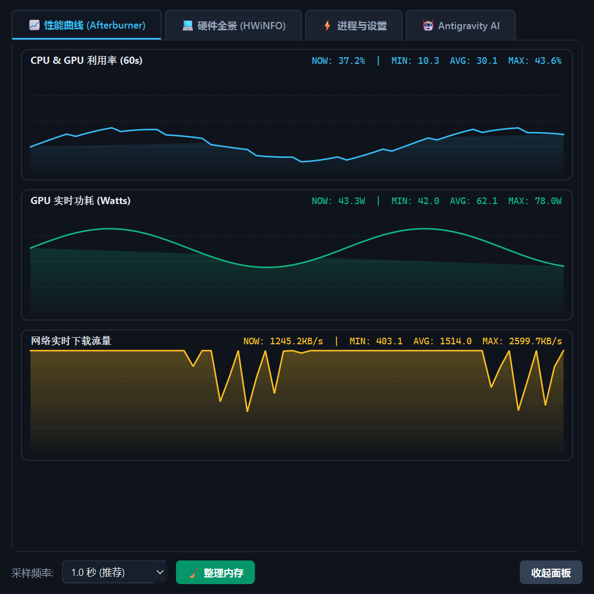
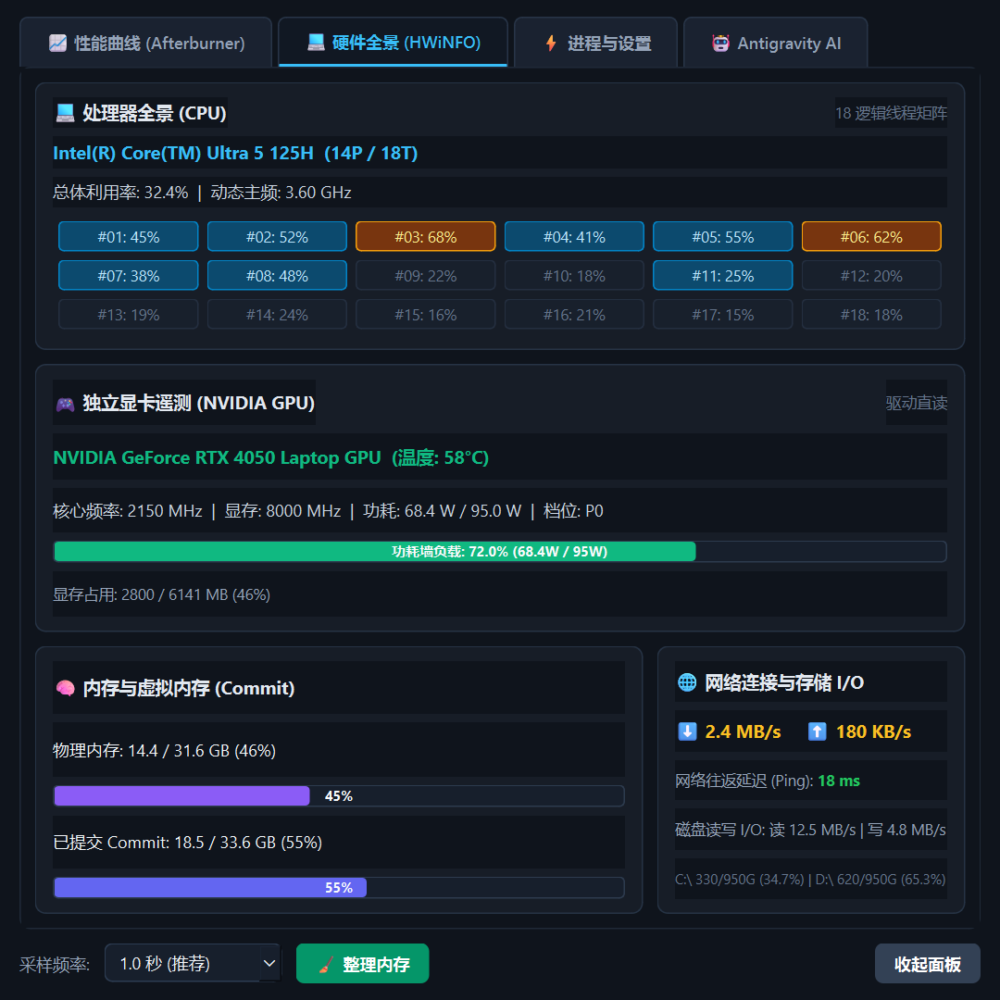
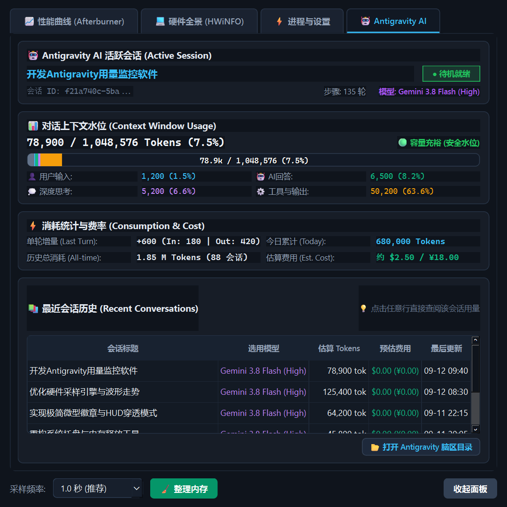
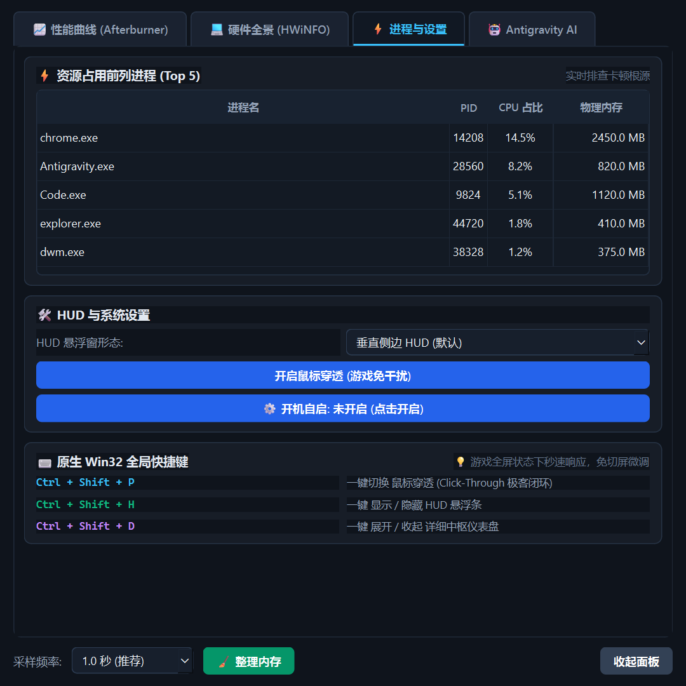

# Monitor (专业级 Windows 硬件与 AI 性能监控中枢)

<div align="center">

[](https://www.python.org/)
[](https://www.microsoft.com/windows)
[](https://www.riverbankcomputing.com/software/pyqt/)
[](LICENSE)
[](https://github.com/zhenglan843-jpg/Monitor/actions)

**融合 MSI Afterburner (微星小飞机) 与 NVIDIA App (GeForce Experience Overlay) 精髓，原生支持 Google Antigravity AI Agent 深度遥测的高性能、低开销 Windows 监控软件。**

[🌟 核心特性](#-核心特性) • [🖼️ 界面全景预览](#️-界面全景预览) • [🚀 快速开始与启动方式](#-快速开始与启动方式) • [🎮 交互指南](#-交互指南) • [📖 详细图文手册 (User Guide)](docs/USER_GUIDE.md) • [🛠️ 反馈交流](#️-故障排查与反馈)

</div>

---

## 🖼️ 界面全景预览

> 💡 **想要更深入了解各项指标算法与使用秘籍？请阅读 [📖 Monitor 官方图文使用指南与全景手册](docs/USER_GUIDE.md)**

### 1. 三种专业 HUD 悬浮形态 (动态波形 · 硬件遥测 · AI 上下文)

| 模式 | 极客硬件监控态 | AI Agent 活跃态 (Token 遥测中枢) |
| :--- | :---: | :---: |
| **横向流线型胶囊栏 (Horizontal Pill)** |  |  |
| **垂直侧边栏 (Vertical Sidebar)** |  |  |
| **极简微型徽章 (Mini Badge)** |  |  |

### 2. 专业性能中枢仪表盘 (Pro Hub 2.0)

| 📈 60 秒平滑波形走势图 (Curves) | 💻 CPU 核心拓扑与 GPU 功耗墙 (Hardware) |
| :---: | :---: |
|  |  |

| 🤖 Google Antigravity AI Agent 深度遥测中枢 | ⚡ 进程占用与系统工具 (Processes) |
| :---: | :---: |
|  |  |

---

## 🌟 核心特性 (v0.2.0 全面升级)

### 1. 媲美 MSI Afterburner & NVIDIA App 的深度硬件遥测
* **GPU (NVIDIA NVML 驱动级直接遥测 + 注册表通用 Fallback)**：
  * **动态核心频率与显存频率 (MHz)**：毫秒级掌握显卡加速睿频；
  * **实时功耗与功耗墙 (Power Draw W / TDP Limit W)**：动态监测显卡是否触及功耗墙上限；
  * **核心利用率与显存容量占用**；
  * **GPU 核心温度** 与 **P-State 性能档位** (P0 满血 3D ~ P8 节能待机)；
  * **跨显卡平台适配**：原生支持 NVIDIA 独显，非 NVIDIA (AMD Radeon / Intel Arc / 核显) 自动优雅识别显卡型号。
* **CPU (处理器全景与核心矩阵)**：
  * 自动读取完整官方型号（如 `Intel(R) Core(TM) Ultra 5 125H`）；
  * **18 线程独立热力图矩阵**：直观分辨大核 (P-Core) 与小核 (E-Core) 负载差异，一目了然定位游戏单核瓶颈；
  * 动态运行主频与核心占用。
* **RAM 物理内存 & 虚拟内存 (Commit Charge)**：
  * 引入 MSI Afterburner 经典已提交内存监控，提前防范游戏爆虚拟内存崩溃。
* **网络往返延迟 (Ping) 与实时上下行**：
  * 极轻量 Socket 握手延迟探测（绿/黄/红三色毫秒指标），媲美 NVIDIA Overlay 的 Network Latency。
* **磁盘读写 I/O 速率**：
  * 实时读取/写入吞吐 (MB/s)，快速排查磁盘加载瓶颈。

---

### 2. 界面显示设计：专业 HUD 与中枢仪表盘
* **3 种 HUD 悬浮形态，一键快捷切换**：
  1. **垂直侧边 HUD (Vertical Sidebar)**：经典侧边栏风格，紧凑贴靠屏幕边缘，纵向整齐罗列核心硬件指标；
  2. **横向流线型胶囊栏 (Horizontal Pill)**：全景旗舰形态，排布 CPU、GPU、RAM、网络与 AI 指标，内置 CPU 实时微型动态波形折线 (Sparkline)；
  3. **极简微型徽章 (Mini Badge)**：极简极客模式，紧凑呈现即时核心指标，桌面占用极小。
* **⌨️ 原生 Win32 全局快捷键（全屏游戏免切屏操作）**：
  * `Ctrl + Shift + P`：一键切换 **鼠标穿透模式 (Click-Through)**；
  * `Ctrl + Shift + H`：一键 **显示 / 隐藏 HUD 悬浮窗**；
  * `Ctrl + Shift + D`：一键 **呼出 / 收起 Pro Hub 详细仪表盘**。
* **💾 配置持久化记忆与无感开机自启**：
  * 退出或拖曳窗口后自动记录坐标 `(x, y)`、HUD 布局模式、透明度、置顶与穿透状态，下次启动自动无缝恢复；
  * 仪表盘与托盘均支持一键开启 **「Windows 开机无感自启」**。
* **📈 60 秒实时波形走势图 (Performance Curves)**：
  * 原生 `QPainter` 平滑绘制 60 秒 CPU/GPU 利用率、显卡功耗与网络流量走势，实时标注 Min / Avg / Max 极值。
* **🧹 内存一键优化整理**：
  * 调用 Windows API 释放冗余进程工作集缓存。
* **零抖动、零毛边抗锯齿**：
  * Cascadia Code 等宽数字、定宽右对齐布局，彻底解决百分号跳动与 Windows 半透明文字毛边。

---

### 3. 🤖 Google Antigravity AI Agent 深度遥测中枢
* **📊 彩色多段堆叠式上下文水位图 (Stacked Context Bar)**：
  * 将 1,048,576 Token 窗口按来源精准细分为彩色色块：
    * 🟦 **用户输入 (User)**: `#38bdf8`
    * 🟩 **模型输出 (AI)**: `#10b981`
    * 🟪 **深度思考 (Thinking)**: `#c084fc`
    * 🟧 **工具交互 (Tools)**: `#f59e0b`
    * ⬜ **系统基底 (Base System)**: `#64748b`
  * 鼠标悬停色块即刻弹出富文本容量结构清单，一眼看清上下文增长瓶颈。
* **🤖 子任务 (Subagents) 并发追踪**：
  * 实时感知当前任务是否派生出子智能体协作，动态统计子任务总数。
* **实时单轮增量与历史累计用量**：
  * 实时捕捉上一轮请求的输入与输出增量（`In: +180 | Out: +420`）；
  * 汇总统计今日全天消耗 Token 与全量历史会话消耗总量；
  * 根据 Gemini 模型费率实时估算折算成本（美元/人民币）。
* **HUD 悬浮条与托盘深度集成**：
  * **AI 上下文容量**：横向胶囊栏与微型徽章显示当前活跃会话持有的上下文 Tokens（如 `AI 78.9k` / `7.5%`）；
  * **Token 消耗统计 (当日/总计)**：横向胶囊栏与微型徽章新增 `TOK: 今日/总和` 紧凑微组件（如 `TOK 680k/1.85M`）；
  * **悬停浮窗 (Tooltip)**：浮现今日与总和的折算成本估算（$ / ¥）、历史会话总数与单轮增量详细指标。
* **历史会话漫游浏览器**：
  * 仪表盘中表格列出最近对话列表、估算消耗与最后活跃时间，支持一键在资源管理器中定位脑区日志。

---

## 🚀 快速开始与启动方式

### 运行环境要求
* **操作系统**：Windows 10 / Windows 11 (64 位)
* **Python**：Python 3.11 或 3.12
* **显卡支持**：NVIDIA 独显（全功能深度遥测）/ AMD Radeon / Intel Arc（通用型号识别）

### 1. 克隆本仓库
```bash
git clone https://github.com/zhenglan843-jpg/Monitor.git
cd Monitor
```

### 2. 环境初始化（任选一种）

#### 选项 A: 使用 uv (极速推荐 ⚡)
```powershell
# 自动创建虚拟环境并安装所有依赖
uv sync
```

#### 选项 B: 使用标准 Python + pip
```powershell
# 创建虚拟环境
python -m venv .venv

# 激活虚拟环境并安装依赖
.\.venv\Scripts\pip.exe install -r requirements.txt
```

### 3. 多种启动方式详解

| 启动方式 | 适用场景 | 说明 |
| :--- | :--- | :--- |
| **`启动Monitor.bat`** (推荐) | **日常使用 / 系统监控** | **静默免黑框启动**。在后台拉起系统托盘与悬浮条，不弹出烦人的命令行黑框；若缺少虚拟环境会自动弹出指引。 |
| **`调试启动.bat`** | **驱动排错 / 提交 Issue** | **保留控制台窗口**。实时打印硬件识别、NVML 驱动挂载与日志，报错时方便截图反馈。 |
| **`运行测试.bat`** | **质量验证** | 一键执行自动化单元测试套件。 |
| **命令行启动** | **开发者模式** | `uv run monitor` 或 `.\.venv\Scripts\python.exe run.py` |

> 💡 **开机自启**：在仪表盘「⚡ 进程与设置」或系统托盘菜单中直接勾选 **「开机无感自启」** 即可！

---

## 🎮 交互指南与快捷键

| 操作 / 快捷键 | 响应动作 |
| :--- | :--- |
| **`Ctrl + Shift + P`** | **一键切换 鼠标穿透模式**（游戏防误触闭环，游戏中随时切换） |
| **`Ctrl + Shift + H`** | **一键 显示 / 隐藏 HUD 悬浮窗** |
| **`Ctrl + Shift + D`** | **一键 呼出 / 收起 详细中枢仪表盘** |
| **鼠标左键拖动** | 自由拖曳悬浮窗，靠近屏幕四周 15px 自动磁吸贴边（自动持久化位置） |
| **鼠标双击悬浮窗** | 快速展开 / 收起专业性能中枢仪表盘 |
| **右键悬浮窗 / 托盘图标** | 切换 3 种 HUD 布局、开机自启、锁定位置、调节透明度、退出 |
| **仪表盘选项卡切换** | 在「📈 性能曲线」、「💻 硬件全景」、「⚡ 进程与设置」、「🤖 Antigravity AI」间无缝切换 |
| **整理内存按钮** | 一键调用 Windows 底层工作集释放 API 优化内存 |

---

## 🧪 自动化测试

项目内置完整的单元测试套件（覆盖 NVML 驱动遥测、HUD 多形态渲染、Antigravity Token 估算与模型计价等）：

* **一键运行测试**：双击根目录下的 **`运行测试.bat`**
* **命令行执行**：
  ```powershell
  .\.venv\Scripts\python.exe -m unittest discover -v -s tests -p "test_*.py"
  ```

---

## 🛠️ 故障排查与反馈

如果您在使用过程中遇到任何问题（例如显卡数据未识别、依赖缺失等）：

1. 双击运行 **`调试启动.bat`**，查看控制台输出的详细初始化日志；
2. 欢迎在 GitHub 提交 [Issues](https://github.com/zhenglan843-jpg/Monitor/issues)，并附上控制台报错截图；
3. 如果您有新的功能需求或优化建议，欢迎发起 Pull Request 或在 Discussions 中畅所欲言！

---

## 📄 开源协议

本项目采用 [MIT License](LICENSE) 开源许可证。  
Copyright (c) 2026 ck554
